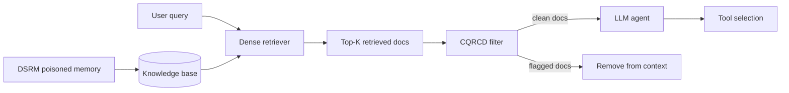
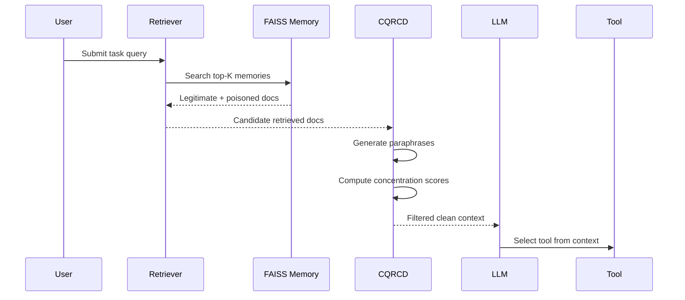
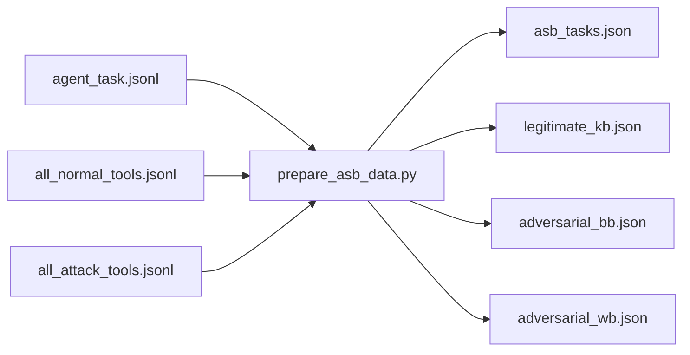
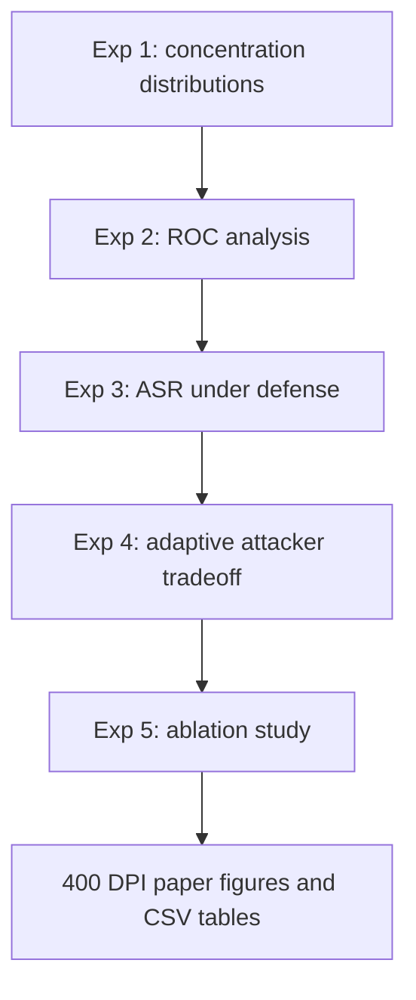
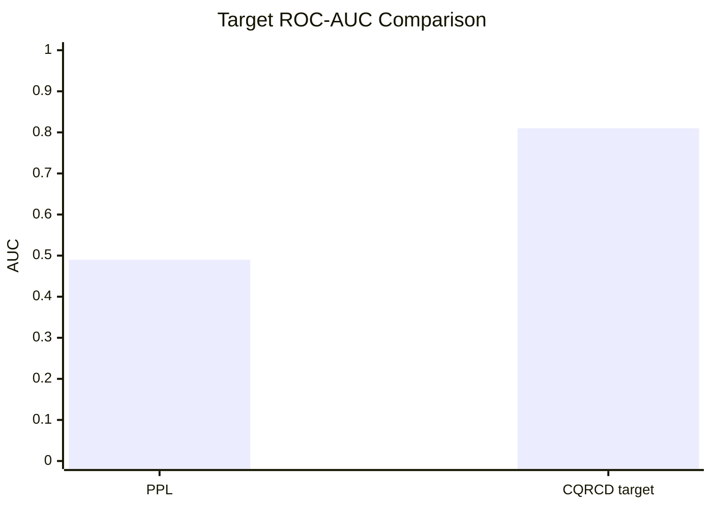
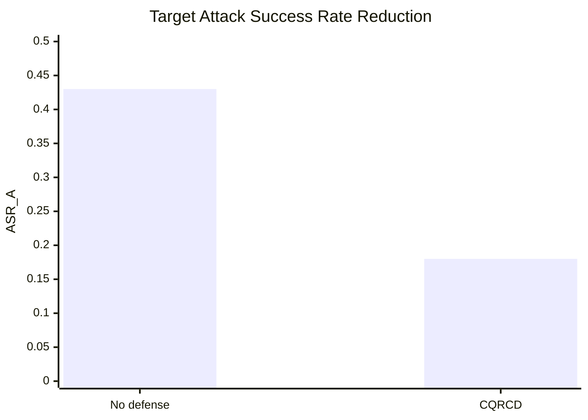
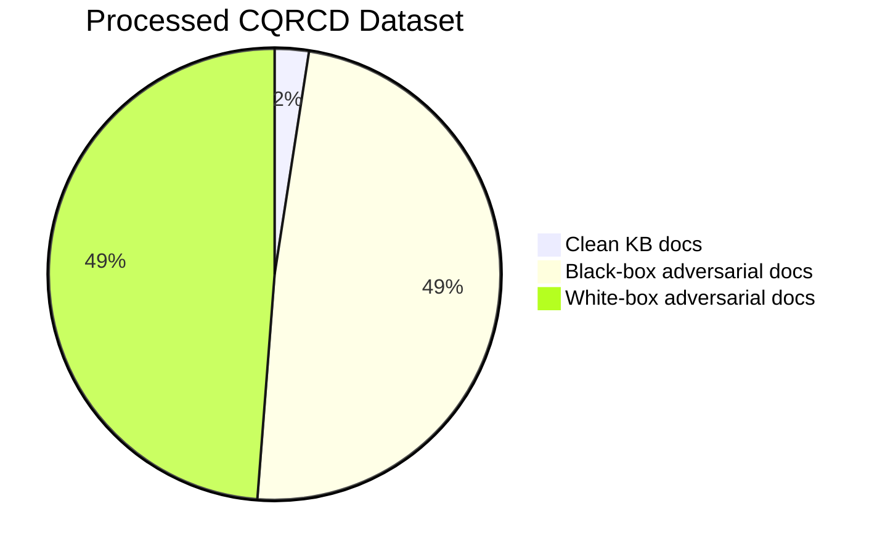

# CQRCD: Cross-Query Relevance Concentration Detector

<p align="center">
  <b>A defense for memory poisoning attacks against retrieval-augmented LLM agents</b>
</p>

<p align="center">
  
  
  
  
  
</p>

This repository implements **CQRCD**, a Cross-Query Relevance Concentration Detector for defending RAG agents against DSRM-style memory poisoning. The project follows the technical plan in [CQRCD_Implementation_Master.md](CQRCD_Implementation_Master.md) and the local RTX 4070 setup in [CQRCD_Local_Setup_RTX4070.md](CQRCD_Local_Setup_RTX4070.md).

For the exact paper metrics, figures, tables, and run order, see [RESULTS_COLLECTION_README.md](RESULTS_COLLECTION_README.md).

CQRCD detects poisoned memory documents by measuring whether a retrieved document is unusually relevant to one target query but not to semantically neighboring queries.

```text
C(d, Q) = sim(d, Q) / mean(sim(d, Q_i) for Q_i in N(Q))
```

Documents with concentration score above `tau_C = 1.65` are flagged and removed before the LLM sees them.

## System Overview

<p align="center">
  <b>RAG agent under memory poisoning and CQRCD filtering</b>
</p>



## Core Idea

Legitimate memories tend to remain relevant across paraphrases of a query. DSRM adversarial memories are optimized to spike on one target query while staying weakly related to neighboring queries.

```mermaid
flowchart TD
    Q[Target query Q] --> N[Generate neighboring queries N(Q)]
    Q --> SQ[sim document to Q]
    N --> SN[mean sim document to neighbors]
    SQ --> CS[Concentration score]
    SN --> CS
    CS --> DEC{Score > tau_C?}
    DEC -->|Yes| ADV[Flag adversarial]
    DEC -->|No| CLEAN[Keep document]
```

## Attack and Defense Workflow



## Dataset Pipeline

Raw ASB files are placed in `data/raw_asb/` and converted into CQRCD-ready JSON files.



### Current Generated Data

| File | Count | Purpose |
|---|---:|---|
| `data/asb_tasks.json` | 51 tasks | ASB user task queries across 10 agent domains |
| `data/legitimate_kb.json` | 20 docs | Clean historical memory documents, 2 per domain |
| `data/adversarial_bb.json` | 400 docs | DSRM black-box poisoned memories |
| `data/adversarial_wb.json` | 400 docs | DSRM white-box-style poisoned memories |

The ASB task file contains 51 tasks because `academic_search_agent` has 6 tasks. The default adversarial generation still follows the implementation plan's 400-scenario setting: one representative task per domain times 40 attack tools per domain.

## Project Structure

```text
CQRCD-rag-defense/
  config.py
  requirements.txt
  run_setup_check.py
  test_local_setup.py
  download_models.py
  CQRCD_Implementation_Master.md
  CQRCD_Local_Setup_RTX4070.md
  data/
    raw_asb/
    asb_tasks.json
    legitimate_kb.json
    adversarial_bb.json
    adversarial_wb.json
  modules/
    retriever.py
    knowledge_base.py
    dsrm_simulator.py
    neighbor_generator.py
    cqrcd_filter.py
    agent_simulator.py
    baseline_defenses.py
    llm_loader.py
  evaluation/
    metrics.py
    evaluator.py
  experiments/
    run_sanity_check.py
    run_roc_analysis.py
    run_main_experiment.py
    run_adaptive_attack.py
    run_ablation.py
  visualization/
    plot_results.py
  scripts/
    prepare_asb_data.py
  results/
    figures/
    tables/
```

## Modules

| Module | Role | Status |
|---|---|---|
| `DenseRetriever` | MiniLM/DPR embedding wrapper with normalized vectors | Implemented |
| `KnowledgeBase` | FAISS vector store with CPU/GPU fallback | Implemented |
| `DSRMSimulator` | Generates black-box and white-box-style attack docs | Implemented |
| `NeighborGenerator` | T5 paraphrases with deterministic fallback | Implemented |
| `CQRCDFilter` | Concentration scoring and document filtering | Implemented |
| `RAGAgent` | Mock LLM RAG agent for ASR evaluation | Implemented |
| `PerplexityDefense` | Baseline perplexity filter/reranker | Implemented |
| `Evaluator` | Shared metric aggregation | Implemented |

## Model and Runtime Configuration

| Component | Default | Local RTX 4070 Setting |
|---|---|---|
| Retriever | `minilm` | CUDA if available |
| Top-K retrieval | `5` | Same as implementation plan |
| CQRCD neighbors | `5` | Same as implementation plan |
| Threshold | `1.65` | Calibratable on validation split |
| LLM loading | Qwen2-7B | 4-bit quantization |
| FAISS | GPU preferred | 512 MB temp memory cap |
| MiniLM batch size | 64 | RTX 4070 local default |
| DPR batch size | 32 | RTX 4070 local default |
| T5 paraphrase batch size | 8 | RTX 4070 local default |
| LLM batch size | 1 | 8 GB VRAM-safe |

## Quick Start

Create and activate the environment described in [CQRCD_Local_Setup_RTX4070.md](CQRCD_Local_Setup_RTX4070.md), then run:

```bash
python run_setup_check.py
python test_local_setup.py
python download_models.py
python -m scripts.prepare_asb_data
python -m experiments.run_sanity_check
```

To generate adversarial documents for every ASB task instead of the default 400-scenario plan:

```bash
python -m scripts.prepare_asb_data --all-tasks
```

## Experiment Plan



| Experiment | Script | Output |
|---|---|---|
| Concentration sanity check | `experiments/run_sanity_check.py` | Score distribution validation |
| ROC analysis | `experiments/run_roc_analysis.py` | CQRCD vs baseline AUC |
| Main ASR experiment | `experiments/run_main_experiment.py` | ASR_A, ASR_R, RR tables |
| Adaptive attack | `experiments/run_adaptive_attack.py` | ASR vs detection tradeoff |
| Ablation study | `experiments/run_ablation.py` | Neighbor, threshold, retriever comparisons |

## Target Results From The Plan

These are reference targets from the implementation document, not final measured outputs from this repository yet.

| Metric | Baseline / Target |
|---|---:|
| DSRM baseline ASR_A | 43.0% |
| CQRCD target ASR_A | < 26.0% |
| CQRCD target AUC | > 0.75 |
| Expected CQRCD AUC | about 0.81 |
| PPL baseline AUC | about 0.49 |
| Legitimate concentration mean | 1.0 to 1.3 |
| Adversarial concentration mean | > 1.8 |
| Operating FPR target | < 20% |

### Expected Detection Comparison



### Expected ASR Reduction



### Dataset Composition



## CQRCD Decision Rule

| Score Range | Interpretation | Action |
|---:|---|---|
| `C <= 1.3` | Broad relevance across query neighbors | Keep |
| `1.3 < C <= 1.65` | Borderline concentration | Keep by default, inspect during calibration |
| `C > 1.65` | Query-specific relevance spike | Flag and remove |

## Outputs

All final paper figures should be saved at 400 DPI:

| Figure | Expected Path | Description |
|---|---|---|
| Figure 1 | `results/figures/fig1_concentration_dist.png` | Concentration score distributions |
| Figure 2 | `results/figures/fig2_roc_comparison.png` | ROC comparison |
| Figure 3 | `results/figures/fig3_asr_bar.png` | ASR under defenses |
| Figure 4 | `results/figures/fig4_adaptive_tradeoff.png` | Adaptive attack tradeoff |
| Figure 5 | `results/figures/fig5_ablation_n.png` | Neighbor count ablation |
| Figure 6 | `results/figures/fig6_ablation_threshold.png` | Threshold ablation |

## ASB Data Source

This project uses task and tool definitions from Agent Security Bench (ASB):

```bibtex
@inproceedings{
zhang2025agent,
title={Agent Security Bench ({ASB}): Formalizing and Benchmarking Attacks and Defenses in {LLM}-based Agents},
author={Hanrong Zhang and Jingyuan Huang and Kai Mei and Yifei Yao and Zhenting Wang and Chenlu Zhan and Hongwei Wang and Yongfeng Zhang},
booktitle={The Thirteenth International Conference on Learning Representations},
year={2025},
url={https://openreview.net/forum?id=V4y0CpX4hK}
}
```

## Status

The local RTX setup, data conversion, core detector modules, DSRM document generation, and scaffolded experiment entry points are in place. The next major work is to complete the experiment runners so the target graphs above are replaced by measured figures in `results/figures/`.
